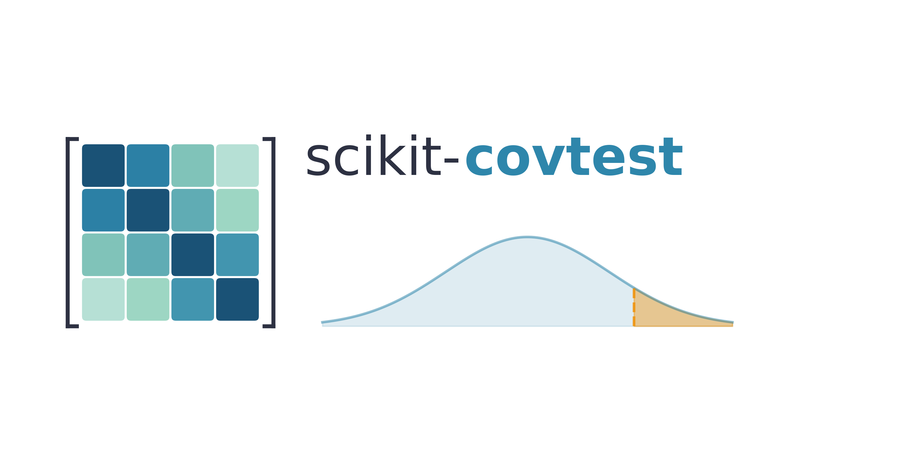

# scikit-covtest

**Covariance matrix hypothesis testing in Python.**

`scikit-covtest` is a Python toolkit for classical and high-dimensional hypothesis testing of covariance matrices. It implements tests for identity, sphericity, proportionality, and equality of covariance matrices using a consistent, lightweight API.

The package also includes utilities for multiple-testing correction, synthetic covariance and data generation, p-value diagnostics, plotting, benchmark datasets, and reproducible method evaluation.

---

## Why scikit-covtest?

Covariance matrices are central to statistics, machine learning, neuroscience, finance, genomics, and other high-dimensional data analysis problems. Many scientific workflows require testing whether a covariance matrix has a particular structure, for example:

- Are variables uncorrelated after standardization?
- Do two groups have the same covariance structure?
- Are two covariance matrices the same up to scale?
- Are many block-level covariance tests significant after FDR correction?
- Are p-values well calibrated under the null?

`scikit-covtest` provides a unified Python interface for these tasks.

---

## Features

### Covariance hypothesis tests

- **Identity tests**  
  Test whether a covariance matrix equals the identity matrix:

  $$H_0: \Sigma = I$$

- **Sphericity tests**  
  Test whether a covariance matrix is proportional to the identity matrix:

  $$H_0: \Sigma = cI$$

- **Two-sample equality tests**  
  Test whether two populations share the same covariance matrix:

  $$H_0: \Sigma_1 = \Sigma_2$$

- **Proportionality tests**  
  Test whether two covariance matrices differ only by scale:

  $$H_0: \Sigma_1 = c\Sigma_2$$

### Supporting functionality

- High-dimensional procedures for settings where \(p\) is comparable to or larger than \(n\)
- Classical covariance tests for lower-dimensional settings
- Multiple-testing correction methods, including FWER and FDR procedures
- Synthetic covariance and data generators for benchmarking
- Heavy-tailed data simulation utilities
- P-value calibration diagnostics
- Multivariate normality and conditioning diagnostics
- Plotting utilities for test diagnostics
- Included benchmark datasets
- Scipy-style return values for simple downstream analysis

---

## Installation

Install from PyPI:

```bash
pip install scikit-covtest
```

Install the development version from GitHub:

```bash
git clone https://github.com/bystrogenomics/scikit-covtest.git
cd scikit-covtest
pip install -e .
```

For development and testing:

```bash
pip install -e ".[dev]"
pytest
```

---

## Quickstart

All hypothesis tests follow the same basic pattern:

```python
import numpy as np
from covtest.methods.hypothesis_two_sample import srivastava_two_sample_2007

rng = np.random.default_rng(42)

X = rng.normal(size=(40, 20))
Y = rng.normal(size=(45, 20))

result = srivastava_two_sample_2007(X, Y)

print(result["stat"])
print(result["p_value"])
```

Most hypothesis tests return a dictionary with at least:

```python
{
    "stat": ...,
    "p_value": ...
}
```

This makes it easy to collect results across methods, simulations, feature blocks, or datasets.

---

## Input conventions

Most functions expect data matrices with shape:

```python
(n_samples, n_features)
```

where rows are observations and columns are variables.

General conventions:

- Inputs may be NumPy arrays or pandas DataFrames.
- Rows should be independent observations.
- Columns should represent variables, features, genes, pixels, markers, or other measured quantities.
- Identity tests usually require standardized variables unless the identity covariance null is meaningful on the original scale.
- Some methods assume multivariate normality or elliptical distributions.
- Some classical methods require \(n > p\).
- High-dimensional methods should be preferred when \(p\) is comparable to or larger than \(n\).
- Missing values are not supported unless explicitly stated by a specific function.

---

## Choosing a test

Different covariance tests are designed for different regimes and alternatives. The right method depends on the null hypothesis, sample size, dimensionality, and expected alternative.

| Goal | Null hypothesis | Example methods | Typical use case |
|---|---:|---|---|
| Identity covariance | \( \Sigma = I \) | Fisher, Ledoit-Wolf, Srivastava, Ahmad-Rosen | Are standardized variables uncorrelated? |
| Sphericity | \( \Sigma = cI \) | Bartlett, John, Srivastava, Hallin-Paindaveine | Are variables uncorrelated with common variance? |
| Two-sample equality | \( \Sigma_1 = \Sigma_2 \) | Box, Schott, Srivastava, Li et al. | Do two groups share the same covariance structure? |
| Proportionality | \( \Sigma_1 = c\Sigma_2 \) | Flury, Eriksen, Liu, Tsukuda-Matsuura | Do two groups have the same correlation structure but different scale? |
| Multiple testing | — | Bonferroni, Holm, BH, BY, Storey q-values | Correct many covariance tests across blocks or features |
| Diagnostics | — | p-value uniformity, QQ plots, Mardia, Henze-Zirkler | Check calibration and assumptions |

### Dense versus sparse alternatives

Some tests are more powerful for dense covariance departures, where many entries change slightly. Others are better for sparse alternatives, where only a few covariance entries change strongly.

As a rule of thumb:

- Frobenius-norm-based tests are often sensitive to dense alternatives.
- Max-type tests are often sensitive to sparse alternatives.
- Operator-norm-based tests are often sensitive to low-rank or directional alternatives.

---

## Examples

### 1. One-sample identity test

Test whether the covariance matrix of a dataset is the identity matrix.

```python
import numpy as np
from covtest.methods.hypothesis_identity import fisher_single_sample

rng = np.random.default_rng(42)

# Generate synthetic data with identity covariance
X = rng.normal(size=(50, 10))

result = fisher_single_sample(X, Sigma="identity")

print(f"Statistic: {result['stat']:.4f}")
print(f"P-value: {result['p_value']:.4f}")
```

---

### 2. Two-sample equality test

Test whether two datasets have the same covariance matrix.

```python
import numpy as np
from covtest.methods.hypothesis_two_sample import srivastava_two_sample_2007

rng = np.random.default_rng(42)

X1 = rng.normal(size=(30, 20))
X2 = rng.normal(size=(40, 20))

result = srivastava_two_sample_2007(X1, X2)

print(f"Statistic: {result['stat']:.4f}")
print(f"P-value: {result['p_value']:.4f}")
```

---

### 3. Proportionality test

Test whether two covariance matrices are proportional.

```python
import numpy as np
from covtest.methods.hypothesis_proportionality import bartlett_adjusted_proportionality_test

rng = np.random.default_rng(42)

p = 5
cov1 = np.eye(p)
cov2 = 2.0 * np.eye(p)

X1 = rng.multivariate_normal(mean=np.zeros(p), cov=cov1, size=30)
X2 = rng.multivariate_normal(mean=np.zeros(p), cov=cov2, size=30)

result = bartlett_adjusted_proportionality_test(X1, X2)

print(f"Statistic: {result['stat']:.4f}")
print(f"P-value: {result['p_value']:.4f}")
```

---

### 4. Multiple-testing correction

Apply FDR correction to a vector of p-values.

```python
import numpy as np
from covtest.multiplicity.fdr import benjamini_hochberg, benjamini_yekutieli

pvals = np.array([0.001, 0.02, 0.20, 0.60])

res_bh = benjamini_hochberg(pvals, alpha=0.05)
res_by = benjamini_yekutieli(pvals, alpha=0.05)

print(res_bh["rejected"])
print(res_bh["pvals_adjusted"])

print(res_by["rejected"])
print(res_by["pvals_adjusted"])
```

---

### 5. P-value diagnostics

Evaluate whether p-values are consistent with a uniform null distribution.

```python
import numpy as np
from covtest import diagnostics as diag

rng = np.random.default_rng(0)
pvals = rng.uniform(0, 1, size=500)

result = diag.analyze_pvalues(
    pvals,
    num_permutations=1000,
    seed=123,
)

print(result.keys())
print(result["ks"])
print(result["storey_pi0"])
```

Plot diagnostic summaries:

```python
from covtest.plotting.null import plot_pvalue_diagnostics_grid

plot_pvalue_diagnostics_grid(pvals, sname="pvalue_diagnostics.pdf")
```

---

### 6. Synthetic covariance and data generation

Generate structured covariance matrices and heavy-tailed samples.

```python
import numpy as np
from covtest import generate_covariance as gc
from covtest import generate_data as gd

rng = np.random.default_rng(42)

Sigma = gc.generate_spiked_covariance(
    p=50,
    spike_eigenvalue=8.0,
    num_spikes=2,
    rng=rng,
)

X = gd.generate_heavy_tailed_samples(
    Sigma,
    n=100,
    dist_type="t",
    rng=rng,
    options={"df": 5},
)

print(X.shape)
```

---

### 7. Included datasets

Load bundled benchmark datasets.

```python
from covtest import datasets as ds

X_mnist, y_mnist = ds.load_mnist(split="train", normalize=True)

X_tcga, y_tcga, gene_names, label_names, sample_ids = ds.load_tcga(
    return_names=True
)
```

---

## Package structure

```text
covtest/
├── methods/          # Covariance hypothesis tests
├── multiplicity/     # Multiple-testing correction
├── simulation/       # Simulation and benchmarking utilities
├── diagnostics/      # Assumption and p-value diagnostics
├── datasets/         # Included datasets
└── plotting/         # Visualization utilities

tutorials/            # Usage examples
benchmarks/           # Method evaluation notebooks
tests/                # Unit tests
```

---

## Statistical notes

Covariance testing is regime-dependent. A method that is valid and powerful in one setting may be poorly calibrated or low-powered in another.

Before choosing a test, consider:

1. **Dimensionality**  
   Is \(p < n\), \(p \approx n\), or \(p > n\)?

2. **Alternative structure**  
   Do you expect sparse, dense, low-rank, or global covariance changes?

3. **Distributional assumptions**  
   Are the observations approximately Gaussian, elliptical, heavy-tailed, or strongly non-normal?

4. **Conditioning**  
   Is the covariance matrix well-conditioned, rank-deficient, or nearly singular?

5. **Multiplicity**  
   Are you running one test or thousands of tests?

When running many tests, use the multiplicity module to control FWER or FDR.

---

## Development

Clone the repository:

```bash
git clone https://github.com/bystrogenomics/scikit-covtest.git
cd scikit-covtest
```

Install in editable mode:

```bash
pip install -e ".[dev]"
```

Run tests:

```bash
pytest
```

Run formatting and linting if configured:

```bash
ruff check .
ruff format .
```

---

## Contributing

Contributions are welcome.

Useful contributions include:

- New covariance hypothesis tests
- Improved documentation and examples
- Benchmarks against published methods
- Additional simulation regimes
- Better diagnostics for assumption checking
- Performance improvements
- Bug fixes and API consistency improvements

When adding a new test, please include:

- A reference to the original method
- Clear assumptions and valid dimensional regimes
- Unit tests
- Simulation checks under the null
- At least one usage example

---

## Citation

If you use `scikit-covtest` in published work, please cite:

```bibtex
@article{talbot_scikit_covtest,
  title = {scikit-covtest: Covariance Matrix Hypothesis Testing in Python},
  author = {Talbot, Austin and Hwang, Ilha and Kotlar, Alex},
  year = {2026}
}
```

---

## License

This project is licensed under the MIT License. See the [LICENSE](LICENSE) file for details.
